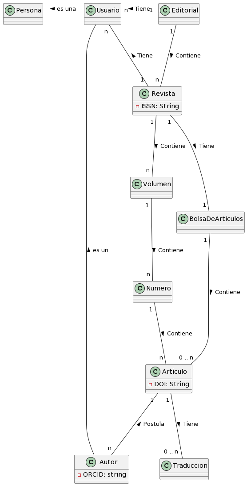

# Modelo Del Dominio

El modelo del dominio nos da un contexto del proyecto e identifica las entidades que dan valor e intervienen en el mismo.

## Glosario
|                      | Descripción                                                                                                                                                 |
| -------------------- | ----------------------------------------------------------------------------------------------------------------------------------------------------------- |
| **Persona**          | Individuo que accede a la plataforma.                                                                                                                       |
| **Usuario**          | Persona registrada con cualquier tipo de rol de los permitidos por el programa; sea autor, editor, gestor, traductor o revisor.                             |
| **Editorial**        | El programa en sí mismo, en él se interactúa con el producto, en este caso las revistas, tanto como para consumirlo como para crearlo, modificarlo y demás. |
| **Revista**          | Producto final ofrecido al consumidor, se compone de volúmenes y artículos y se reparte en números (normalmente dos).                                       |
| **Volumen**          | Divide la revista por años, conformados por uno o dos números cuando más.                                                                                   |
| **Numero**           | Cada sección de un volumen de la revista ofrecida a los usuarios, normalmente dos anuales.                                                                  |
| **Articulo**         | Conforman los números, pueden ser de temas diferentes pero con una temática general entre ellos.                                                            |
| **BolsaDeArticulos** | Es el lugar donde se almacenan todos los artículos que se encuentran aprobados y pendientes de agregar a un número                                          |
| **Autor**            | Usuario que postula un artículo para su publicación.                                                                                                        |
| **Traducción**       | Es una versión de un artículo en otro idioma                                                                                                                |

## Diagramas

  
Diagrama de clases

  
|         Diagrama de clases         
| :-: 
|  

  
Diagrama de estados

    Describe el proceso que sigue un número perteneciente al volumen de una revista antes de ser publicado.

  

| Estado                             | Descripción                                                                                |
| ---------------------------------- | ------------------------------------------------------------------------------------------ |
| **Artículo Postulado**             | El artículo ya se encuentra postulado por el autor.                                        |
| **Artículo Pendiente de Revisar**  | El artículo se encuentra pendiente de ser revisado por el revisor.                         |
| **Artículo Revisado**              | El artículo ya ha sido revisado por el revisor.                                            |
| **Artículo Aprobado**              | El artículo cumplió todos los parámetros y fue aprobado.                                   |
| **Artículo Rechazado**             | El artículo no fue aprobado.                                                               |
| **Artículo editado**               | El artículo fue editado para volver a pasar todo el proceso de aceptación.                 |
| **Artículo Eliminado**             | El autor tomó la decición de eliminar su artículo y no volver a postularlo.                |
| **Artículo Pendiente de Publicar** | El artículo fue aprobado y se encuentra en la bolsa de artículos pendiente de publicación. |
| **Número Maquetado**               | Se conformó un número y fue maquetado con los artículos correspondientes.                  |
| **Número Traducido**               | Todos los artículos del número fueron traducidos.                                          |

  
| Diagrama de estados Publicación de un número
| :-: 
| 

  
Diagrama de objetos

  
    Brinda una imágen de cómo se puede comportar la aplicación.

|Diagrama de objetos Estado Inicial
|:-:
|

|Diagrama de objetos Estado Avanzado
|:-:
|

[Atrás](../readme.md)